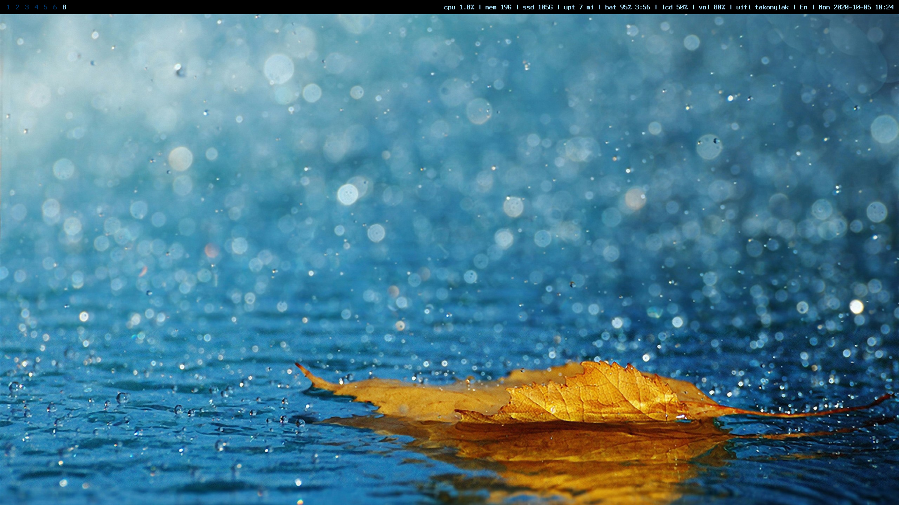
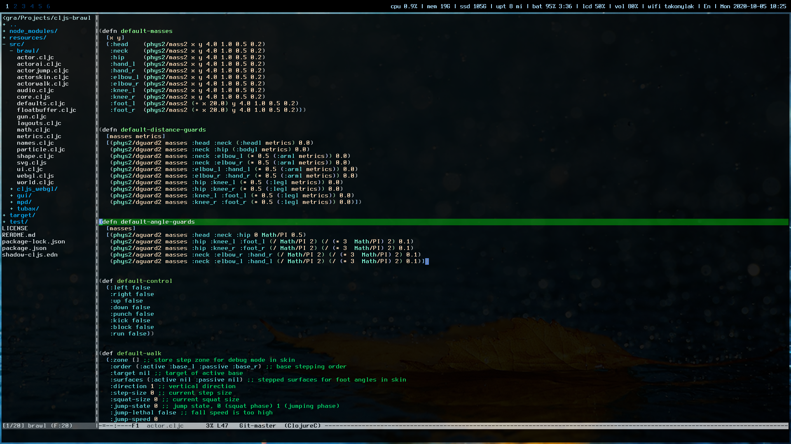
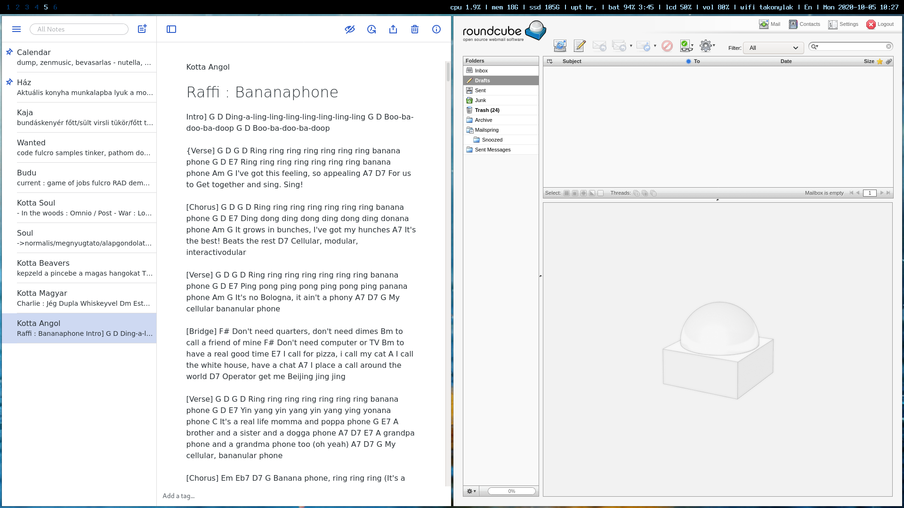

# Pretty and functional FreeBSD desktop for design freaks





FreeBSD is the best (server) operating system and it has everything linux has for desktop use besides drivers. The FreeBSD user/dev community is much smaller than Linux's so not all laptop driver is arriving for FreeBSD and the others are arriving slowly - usually 1-2 years is needed. So if you want the FreeBSD laptop experience you better start with an older and supported laptop or go with a desktop machine.

**So why choose FreeBSD over Linux?**
- one kernel one distro - no fragmentation
- exteremely well architected, clean design
- logical command line tools (pkg install vs pacman -Qs, pkg info vs dpkg -s, pkg search vs pacman -Ss)
- no systemd and pulse audio
- no random malfunctions, surprises after rolling updates

**Why not choose FreeBSD over Linux?**
- no drivers for your laptop
- you need Spotify, Netflix or Steam

**Installing**

We will install the latest CURRENT ( = dev branch or nightly build ) which is 13.0-CURRENT to have the latest drivers. 

Download the latest memstick image from here :
https://download.freebsd.org/ftp/snapshots/ISO-IMAGES/13.0/

Burn it to a flash drive with your favorite tool and boot up your machine with it.

1 Select install  
2 Select default keyboard  
3 Choose host name  
4 At Optional System Components select ports tree and system source tree, they can be useful when you want to recompile the kernel for some reason or if an utility is non-BSD licensed and not present in pkg repository.  
4 Partition your drive - Auto UFS is the best for laptops but feel free to go with other, let the installer create the partitions  
5 Select root password  
6 Select network - if there is no driver for your wifi hardware then no wireless will appear in the list. Let the installer auto config DHCP and everything  
7 Select your region
8 Select time and date  
9 Select services at boot : ntpd powerd and dumpdev  
10 No hardening options  
11 Add a separate user for yourself besides root
12 Reboot  

Cool, the base system is ready. Now we have to install the needed tools and drivers.

**Basic Setup**

Login with the root user

Check internet connection first : ping freebsd.org
If it's not working you have to figure out why the wifi interface is down - dmesg, sysctl, etc, google bravely!

**pkg and sudo**

Install sudo first:

```
pkg install sudo
```

It will offer you to install pkg first, say yes. After installing pkg, say yes for sudo install.

Now we have to add your separate user to the sudoers file to make things comfortable. Type :

```
visudo
```

Go down/page down to the bottom, go to the end of the line, press i to enter edit mode, press enter to go to newline, type

```
youruser ALL=(ALL)
```

Press escape, type :wq to save it. If you want to quit without saveing press esc anytime and type :q!

Now your user is in the sudoers file. Type exit to log out as root and login as your user.

**default shell : zsh**

Let's install zsh because it can figure out your thoughts.

```
sudo pkg install zsh
```

Now we need to change the default shell to it :

```
chsh -s zsh
```

Cool, now log out with your user and log in, zsh will ask for default settings, generate a config with the default settings.

**window manager: sway**

```
sudo pkg install sway swaylock swayidle dmenu alacritty slurp grim
```

sway is the wayland based window manager
swaylock is the screen lock utility for sway
swayidle is the idle lock utility for sway
dmenu is the default launcher for sway
alacritty is the default wayland based terminal for sway
slurp is the default screenshot utility for sway
grim is the default screen region shot utility for sway

For sway to run XDG_RUNTIME_DIR has to be set, let's add it to .zshrc

```
vi .zshrc
```

Go to the end of file, go into edit mode with i and type

```
export XDG_RUNTIME_DIR=/tmp
```

Press escape and type :wq to save and exit.

Logout and login again.

**video drivers**

After login, type

```
sway
```

If it shows up you have video drivers/the default driver works for you. If not you have to tell FreeBSD to load it at startup.
The video drivers for FreeBSD are called drm-kmod, drm-current-kmod, drm-devel-kmod.
Since we are on the CURRENT branch we have to use drm-current-kmod

```
sudo pkg install drm-current-kmod
```

Now depending on your GPU manufacturer you have to load the corresponding kernel mode settings. I have an intel UHD so I will go with i915kms. Adding new lines to /etc/rc.conf is done with an editor or with the sysrc tool, we will use the latter.

```
sudo sysrc kld_list += "i915kms"
```

Cool, now reboot by typing

```
sudo reboot
```
If the screen reamined black after reboot, then you installed or selected the wrong driver. Don't panic, reboot in single user mode, it starts up with the bios vesa driver, you can safely login and remove the driver from /etc/rc.conf and then you can reboot and login in the normal way.

After login check if driver is loaded :

```
dmesg | grep drm
```

If it's loaded then greay, start up sway.

```
sway
```

You should see a beautiful blue background. To open a terminal press WIN+ENTER. To open the launcher menu press WIN+d and start typing anything. To kill a window press WIN + SHIFT + q

Cool but why doesn't the touchpad working?!?!?

**touchpad***

It you have no touchpad you have to install the latest iichd drivers.

```
sudo pkg install iichd
```

And the let's load them at startup :

```
sudo sysrc ig4_load="YES"
sudo sysrc iicbus_load="YES"
sudo sysrc iichid_load="YES"
sudo sysrc kld_list+="ig4 iichid"
```

Reboot, login and touchpad should work.

**webcam**

To make the webcam work webcamd has to be installed and started, usb unit.addr has to be set ( the example should work for 99 percent of the machines ) and you have to add your user to webcamd group

```
sudo pkg install webcamd
sudo sysrc kldnlist+="cuse"
sudo sysrc webcamd_enable="YES"
sudo sysrc webcamd_0_flags="-d 0.2 - I 0 -v 0"
sudo groupmod webcamd -m youruser
````

Reboot, login and webcam should work. Let's test it on the web!

**chromium, firefox***

```
sudo pkg install chromium
sudo pkg install firefox
```

Start up chromium and go to a webcam tester page, does it work?

**set default sway config**

Copy default config. Let's check where is the default config :

```
pkg info -l sway
```
It's under /usr/local/etc/sway/config.sample. Let's copy it to ~/.config/sway/

```
mkdir -p ~/.config/sway
cp /usr/local/etc/sway/config.sample ~/.config/sway/
```

Don't forget that by pressing TAB in the terminal it completes the path or lists possible subfolders if you are uncertain.

**make sway autostart at terminal 0**

```
vi .zshrc
```

At the bottom add

```
if [[ -z $DISPLAY ]] && [[ $(tty) = /dev/ttyv0 ]]; then
 exec sway
fi

```

Now after reboot and login sway will start automagically.


turn off GPU

sudo PKG install acpi_call

kldnlist+= "acpi_call'

mkdir Scripts
touch turn off GPU.sh

add command to sudo nopasswd
add it to zshrc before sway


stop beeping

sysrc allscreen_kbdflags="-b quiet.off"

mount Linux filesystems
sysrc kldnlist+="ext2fs"

auto mount

sysrc autofs_enable="YES"
sudo vi /etc/auto_master
uncomment media line

sudo PKG install x11/rxvt-unicode

sudo PKG install terminus-font
pimp sway

swaybar.sh
swaylock.sh
swaystart.sh
Inc brightness
Dec brightness
enable java

Firefox enable ssn

sudo PKG install emacs-nox 
copy Emacs conf

sudo PKG install clojure Leiningen

pimp zsh
pkg autosuggest
PKG syntax high
git download history substring

PKG install npm
npm install shadow cljs


sudo pkginstall libreoffice

sudo pkg install virtualbox-ose

firefox theme aurora australis

libinpit list devices
automount /etc automaster

RC conf loader conf sysctl conf

zsh - -etc/local/share plugin

wifimgr!!

volume, brightness - MOD key instead of Fn

report iwm 9560 startup problem, acpi, resume

numlock?
resume?

