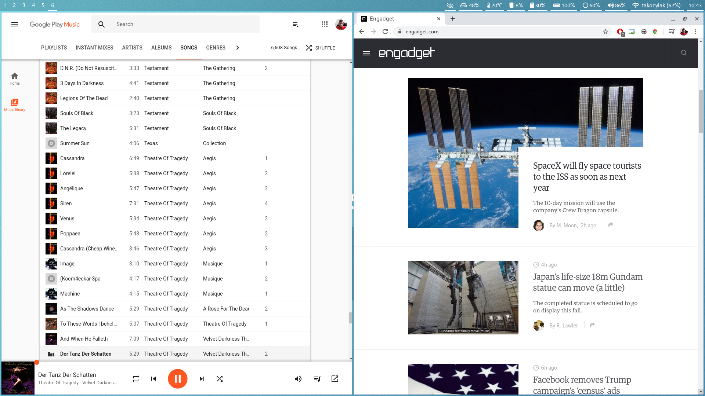
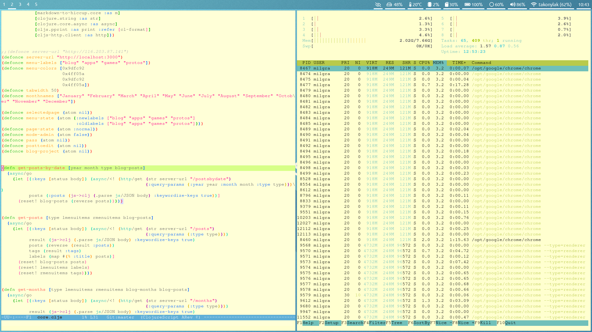

# Pretty and functional linux/unix desktop for former Mac users and design freaks




Can we push minimalism to the limit? Of course we can! We will install a minimal linux distro with a tiling window manager for the smallest disk/memory footprint as possible ( because that memory is needed for the dev tools! :) ) but we will also make it comfortable for everyday use ( wifi selector, audio controls, productivity apps, gaming ready, lock/idle/sleep, etc).

It is targeted at Manjaro Linux but these programs can be installed on every major linux/unix distribution with strong community support, the only thing you have to know the distro specific package manager which is pacman on Manjaro Linux.

## Part I : Reaching basic functionality

**install**

download [Manjaro Architect](https://manjaro.org/download/official/architect/) and burn it to some external media

boot up the machine from it

we are going for the command line interface ( CLI ) system

select default settings for everything

at install custom pacakages part : select network manager, we will need it for connecting to a wifi after startup

at install hardware drivers part install display drivers

check out the detailed howto if you are lost :

( https://forum.manjaro.org/t/installation-with-manjaro-architect-iso/20429 )

reboot

**enable and start network/wifi service**

```sudo systemct enable NetworkManager```
```sudo systemct start NetworkManager```

**connect to your wifi**

```nmcli -d WiFi connect networkname -password password```

**install sway with waybar and xwayland bridge so x apps can work**

```sudo pacman -S sway waybar xorg-server-xwayland wayland-protocols```

**install default sway terminal and launcher**

```sudo pacman -S dmenu alacrity```

**start sway**

```sway```

And we have a basic desktop. Feel free to experiment with it, the commonly used shortucts are :

press WIN(MAC) + ENTER to open the terminal

press WIN(MAC) + D to open dmenu and start typing program names to launch something

press WIN(MAC) + numbers to switch desktops

press WIN(MAC) + SHIFT + numbers to move window to another desktop

press WIN(MAC) + r to resize window

press WIN(MAC) + v or h to decide to place next window in a horizontal or vertical split

## Part II : Extending functionality

In this chapter we will edit config files with nano. The used nano shortucts are :

CTRL + O write file

CTRL + X exit

CTRL + W find

ALT + U undo

CTRL + K cut

CTRL + U uncut

**first copy default sway, waybar and alacritty configs under your home folder's config folder**

```
mkdir -p ~/.config/sway 
mkdir -p ~/.config/waybar
mkdir -p ~/.config/alacritty
cp /etc/xdg/waybar/* ~/.config/waybar/
cp /etc/sway/config ~/.config/sway/
cp /usr/share/doc/alacritty/example/alacritty.yml ~/.config/alacritty
```

**setup display brightness control**

install light for brightness handling

```sudo pacman -S light```

try it 

```light -A 10```

if it's not working then your GPU's manufacturer made GPU utils root only so you have to modify permissions.
in my case ( which is an integrated intel GPU ) : 

```sudo chmod a+w /sys/class/backlight/intel_backlight/brightness```

add brightness shortcuts to sway and waybar config

```
nano ~/.config/sway/config
```
insert these lines at the bottom
```
bindsym XF86MonBrightnessUp exec light -A 5    # increase screen brightness
bindsym XF86MonBrightnessDown exec light -U 5  # decrease screen brightness

nano ~/.config/waybar/config
```
insert these lines at the bottom
```
"backlight": {
"on-scroll-up" : "light -A 5",
"on-scroll-down" : "light -U 5"
}
```

exit nano then press WIN(MAC) + SHIFT + C to reload sway config

now you can control display brightness with the brightness keys on the keyboard and by moving over the display brightness block on swaybar and scroll up/down

**setup volume control**

install pulseaudio and alsa

```sudo pacman -S pulseaudio alsa-utils```

this enables and starts alsa service and installs handy utils. launch alsamixer

```alsamixer```

unmute needed channels with M, left/right arrow to change sources

add shortcuts to sway and waybar config

```
nano ~/.config/sway/config
```
add these lines
```
bindsym XF86AudioRaiseVolume exec --no-startup-id pactl set-sink-volume @DEFAULT_SINK@ +10%
bindsym XF86AudioLowerVolume exec --no-startup-id pactl set-sink-volume @DEFAULT_SINK@ -10%
bindsym XF86AudioMute exec --no-startup-id pactl set-sink-mute @DEFAULT_SINK@ toggle
```

press WIN(MAC) + SHIFT + C to reload sway config

now you can control volume with the volume keys on the keyboard and by moving over the volume block on swaybar and scroll up/down

```nano ~/.config/waybar/config```

add this to pulseaudio module :

```"on-click": "swaymsg exec '$term -e alsamixer'"```

so on click it will bring up alsamixer TUI for deeper control

to fix bluetooth audio problems ( shown by systemctl --user status pulseaudio )

```systemctl enable bluetooth.service to get rid of error in systemctl```

**setup touchpad**

get your touchpad's hardware id

```
libinput -list-devices
```
edit sway config and add these lines with your hardware id
```
nano ~/.config/sway/config

** enable tap and natural scroll **
input 1739:52575:MSFT0001:01_06CB:CD5F_Touchpad tap enabled
input 1739:52575:MSFT0001:01_06CB:CD5F_Touchpad natural_scroll enabled

** make touchpad smoother **
input 1739:52575:MSFT0001:01_06CB:CD5F_Touchpad accel_profile flat
input 1739:52575:MSFT0001:01_06CB:CD5F_Touchpad pointer_accel 0
```

**setup sway autostart**

edit your shell's profile

```nano ~/.bash_profile```

or

```nano ~/.zshrc```

add this at the end of the file :

```
if [[ -z $DISPLAY ]] && [[ $(tty) = /dev/tty1 ]]; then
  XKB_DEFAULT_LAYOUT=us exec sway
fi
```

and now after restart and login you hop in sway

**setup idle, lock, sleep***

install swaylock and swayidle

```sudo pacman -S swaylock swayidle```

edit sway config

```nano ~/.config/sway/config```

uncomment this :

```
exec swayidle -w \
          timeout 300 'swaylock -f -c 000000' \
          timeout 600 'swaymsg "output * dpms off"' \
               resume 'swaymsg "output * dpms on"' \
          before-sleep 'swaylock -f -c 000000'
```

**setup language switching**

```nano ~/.config/sway/config```

add this with your device id

```
input "1165:49408:ITE_Tech._Inc._ITE_Device(8910)_Keyboard" {
	xkb_layout "us,hu"
	xkb_variant ",101_qwerty_dot_nodead"
	xkb_options "grp:alt_space_toggle"
	repeat_rate 60
    	repeat_delay 250
}
```

this also increases key repeat rate so I can scroll faster in source code's
switch languages with ALT+SPACE

**wifi channel selector**

edit waybar

```nano ~/.config/waybar/config```

add this to network module :

```"on-click": "swaymsg exec '$term -e nmtui-connect'"```

so if you click on the network block it will pops up the network selector in a terminal

**setup dmenu to show up over waybar**

edit waybar config and modify the top line

```nano ~/.config/waybar/config```

```"layer": "bottom"```

**screenshot and screen grabbing**

install grim, slurp
```
sudo pacman -S grim slurp 
```

edit sway config :

```
set $screenshot grim ~/Downloads/scrn-$(date +"%Y-%m-%d-%H-%M-%S").png
set $screenclip slurp | grim -g - ~/Downloads/scrn-$(date +"%Y-%m-%d-%H-%M-%S").png

bindsym $mod+Print exec $screenshot
bindsym $mod+Shift+Print exec $screenclip
```

Now you can create a screenshot or region shot with WIN(MAC)+PrintScreen and WIN(MAC)+Shift+PrintScreen

## Part III : Customizing the desktop

install ubuntu font

```sudo pacman -S ttf-ubuntu-font-family```

**sway**

add these to sway config :

```nano ~/.config/sway/config```

```
**gaps**
gaps inner 3

**borders**
default_border pixel 1
default_floating_border pixel 1
```

**waybar**

add these to waybar style :

```nano ~/.config/waybar/style.css```

modify window#waybar class:

```
background-color: rgba(0,0,0,0.2);
/* border-bottom: 3px solid rgba(100, 114, 125, 0.5); */
font-family: Ubuntu;
font-size: 15px;
```

modify common block css, add disk, modify color, border :

```
#clock,
#battery,
#cpu,
#memory,
#temperature,
#backlight,
#network,
#pulseaudio,
#custom-media,
#tray,
#mode,
#disk,
#idle_inhibitor,
#mpd {
    padding: 0 5px;
    padding-top: 3px;
    margin: 0 4px;
    color: #ffffff;
    border-bottom: 3px solid #ffffff;    
}
```

delete background colors from all individual block classes ( CTRL-K in nano )

```nano ~/.config/waybar/config```

remove unnecessary symbols from block formats, bring icons to the left of the labels and optionally rearrange them

add disk icon to disk module:

```
"disk":{
    "format":"  {percentage_free}% "
},
```

**alacritty**

edit config
```
nano ~/.config/alacritty/alacritty.yml
```

invert colors :

```
colors:
    primary:
  	background: '0xffffcf'
  	foreground: '0x8a8a8a'
	dim_foreground: '0x9a9a9a'
	bright_foreground: '0x6a6a6a'
```

## Part IV : Productivity apps

**install AUR package manager for user produced packages**

```sudo pacman -S yay```

**install midnight commander for managing files**

```sudo pacman -S mc```

It you don't like terminal based file managing you can install nautilus or dolphin, the two most advanced GUI file managers for Linux but if you are coming from a Mac you will be crying after a few days using these. Better learn mc.

**install usbmount for automounting**

```yay -S usbmount```

**install google chrome**

```yay -S google-chrome```

Open chrome and install the following extensions :

**Open-as-Popup**

You can open a page in a tab-barless window and they will look like desktop apps. I use it for Google Music, Google Drive, messenger.com, Google Photos, etc

**Chromium Wheel Smooth Scroller**

Simulates MacOS like inertia-scrolling in chrome

**For auto-opening stuff in the proper app use xdg-utils**

```sudo pacman -S xdg-utils```

**For Photos,Music,Drive use Google services in Chrome, no linux desktop app come close to them in quality and syncing capablities**

**LibreOffice for documents/spreadsheet editing or use Google Docs/Sheets**

```sudo pamcan -S libreoffice```

**Gimp for photo editing/Gfx**

```sudo pacman -S gimp```

**Kdenlive for video editing**

```sudo pacman -S kdenlive```

**Ocenaudio for audio editing**

```yay -S ocenaudio```

**Skype for conferencing or use duo/hangouts**

```yay -S skype```

**Mailspring for emails or use gmail in chrome**

```yay -S mailspring gnome-keyring```

at first startup gnome-keyring asks for a password, leave it blank, no other apps will use it

**Simplenote for notes or use some online stuff**

```yay -S simplenote```

**bluetooth audio**

there are plenty of bluetooth controllers, if you want a GUI one try blueman :

```sudo pacman -S blueman```

If you want a CLI one, try bluez. Someone should write a TUI for it like nmtui.

```sudo pacman -S bluez bluez-utils```

**connect to bluetooth headset**

start bluetoothctl

```bluetoothctl```

[bluetooth]# power on
[bluetooth]# agent on
[bluetooth]# default-agent
[bluetooth]# scan on

Now make sure that your headset is in pairing mode. It should be discovered shortly. For example,

[NEW] Device 00:1D:43:6D:03:26 Lasmex LBT10

[bluetooth]# pair 00:1D:43:6D:03:26
[bluetooth]# connect 00:1D:43:6D:03:26

If you are getting a connection error org.bluez.Error.Failed retry by killing existing PulseAudio daemon first:
$ pulseaudio -k
[bluetooth]# connect 00:1D:43:6D:03:26
If everything works correctly, you now have a separate output device in PulseAudio.

[bluetooth]# scan off
[bluetooth]# exit

## Part V : Gaming

**Steam**

```
yay -S steam
```
If you have a dedicated Nvidia GPU in your machine you can install nvidia-xrun to switch to that GPIU when gaming. OpenBox is also needed because nvidia-xrun has to be opened on a different virtual console.
```
sudo pacman -S nvidia-xrun openbox
```

**using the dedicated GPU (for DOOM 2016 for example)**

go to a different virtual terminal CTRL+ALT+F2

login

```nvidia-xrun openbox```

right click anywhere, go to terninal->open terminal


**emacs color problem fix in zsh**

edit bash_profile or zshrc and add this line at the end

```export TERM=xterm-256color```

add theme ( download and copy it to ~/.emacs.d , in emacs customize-themes )

moe-light-theme https://github.com/bbatsov/solarized-emacs


# chromium scroll glitching fix


# java 8 for clojure/datomic, emacs without x, clojure

```
 sudo pacman -S jdk8-openjdk clojure emacs-nox leiningen
 sudo pacman -S unzip
 download emacs config from github.com/milgra/linuxconfig
```
 
 

# npm

```
sudo pacman -S npm
sudo npm install -g shadow-cljs
```

# datomic

download from my.datomic.com/account with wget

peer library :

```sudo pacman -S gnupg```

generate key

```gpg --gen-key```

create 

./lein/credentials.clj 

with contents from my.datomic.com/account

```gpg --default-recipient-self -e ~/.lein/credentials.clj > ~/.lein/credentials.clj.gpg```

check validity

```gpg --quiet --batch --decrypt ~/.lein/credentials.clj.gpg```

now leiningen can download the peer library for a project on request
	
# media browser

```chrome file://```

# git credential setup

```
git config --global user.name "dzou"
git config --global user.email "dzou@company.com"
git config --global credential.helper store
```


# steam?

