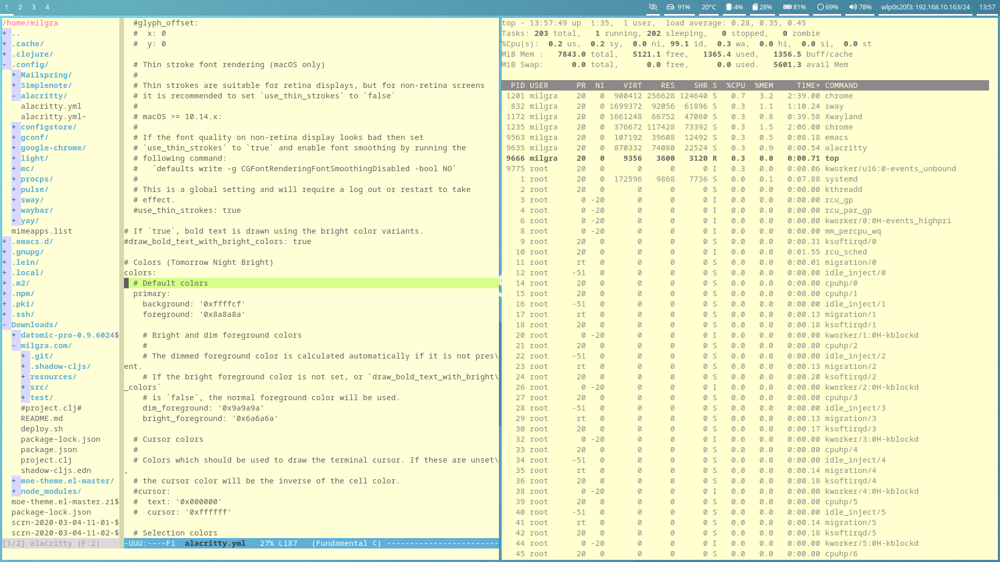

# Pretty and functional linux desktop for former Mac users and design freaks

# install

( https://forum.manjaro.org/t/installation-with-manjaro-architect-iso/20429 )

download Manjaro architect and burn it to some external media

boot up the machine from it

select default settings for everything

install cli system

at install custom pacakages part : select network manager, we will need it for connecting to a wifi after startup

at install hardware drivers part install display drivers

reboot

# startup

**start network/wifi service**

sudo systemct enable network manager 

( start ? )

**connect to your wifi**

nmcli -d WiFi connect networkname -password password

**install sway with waybar and xwayland bridge so x apps can work**

sudo pacman -S sway waybar xorg-server-xwayland wayland-protocols

**install default sway terminal and launcher**

sudo pacman -S dmenu alacrity 

**start sway**

sway

press WIN(MAC) + ENTER to open terminal
press WIN(MAC) + D to open dmenu and start typing to launch something
press WIN(MAC) + numbers to switch desktops
press WIN(MAC) + SHIFT + numbers to move window to another desktop
press WIN(MAC) + r to resize window

# google chrome

**install AUR package manager**

sudo pacman -S yay

**install google chrome**

yay S google-chrome

# copy default sway and waybar configs

mkdir .config/sway 

mkdir .config/waybar

cp /etc/xdg/waybar/* ~/.config/waybar

cp /etc/sway/config ~/.config/sway

# display brightness control

install light

sudo pacman -S light

set execution permissions to user for backlight

sudo chmod a+w /sys/class/backlight/intel_backlight/brightness  

we will edit config files with nano. nano shortcuts :
CTRL + O write file
CTRL + X exit
CTRL + W find
ALT + U undo
CTRL + K cut
CTRL + U uncut

add shortcuts to sway and waybar config

nano ~/.config/sway/config

bindsym XF86MonBrightnessUp exec light -A 5    # increase screen brightness

bindsym XF86MonBrightnessDown exec light -U 5  # decrease screen brightness

nano ~/.config/waybar/config

"backlight": {
   "on-scroll-up" : "light -A 5",
   "on-scroll-down" : "light -U 5"
}

press WIN(MAC) + SHIFT + C to reload sway config

now you can control display brightness with the brightness keys on the keyboard and by moving over the display brightness block on swaybar and scroll up/down

# volume control

install pulseaudio and alsa

sudo pacman -S pulseaudio alsa-utils

this enables and starts alsa service and installs handy utils

alsamixer

unmute needed channels with M, left/right arrow to change sources

add shortcuts to sway and waybar config

nano ~/.config/sway/config

bindsym XF86AudioRaiseVolume exec --no-startup-id pactl set-sink-volume @DEFAULT_SINK@ +10%

bindsym XF86AudioLowerVolume exec --no-startup-id pactl set-sink-volume @DEFAULT_SINK@ -10%

bindsym XF86AudioMute exec --no-startup-id pactl set-sink-mute @DEFAULT_SINK@ toggle

press WIN(MAC) + SHIFT + C to reload sway config

now you can control volume with the volume keys on the keyboard and by moving over the volume block on swaybar and scroll up/down

nano ~/.config/waybar/config

add this to pulseaudio :

"on-click": "swaymsg exec '$term -e alsamixer'"

so on click it will bring up alsamixer for deeper control

to fix bluetooth audio problems ( shown by systemctl --user status pulseaudio )

systemctl enable bluetooth.service to get rid of error in systemctl

# touchpad tweaks

get your touchpad's hardware id

libinput -list-devices

nano ~/.config/sway/config

** enable tap and natural scroll **
input 1739:52575:MSFT0001:01_06CB:CD5F_Touchpad tap enabled
input 1739:52575:MSFT0001:01_06CB:CD5F_Touchpad natural_scroll enabled

** make touchpad smoother **
input 1739:52575:MSFT0001:01_06CB:CD5F_Touchpad accel_profile flat
input 1739:52575:MSFT0001:01_06CB:CD5F_Touchpad pointer_accel 0

# autostart sway

nano ~/.bash_profile

or

nano ~/.zshrc

add this at the end of the file :

if [[ -z $DISPLAY ]] && [[ $(tty) = /dev/tty1 ]]; then
  XKB_DEFAULT_LAYOUT=us exec sway
fi

# idle, lock, sleep

install swaylock and swayidle

sudo pacman -S swaylock swayidle

nano ~/.config/sway/config

uncomment this :

exec swayidle -w \
          timeout 300 'swaylock -f -c 000000' \
          timeout 600 'swaymsg "output * dpms off"' \
               resume 'swaymsg "output * dpms on"' \
          before-sleep 'swaylock -f -c 000000'

# language switching

nano ~/.config/sway/config

add this with your device id

input "1165:49408:ITE_Tech._Inc._ITE_Device(8910)_Keyboard" {
	xkb_layout "us,hu"
	xkb_variant ",101_qwerty_dot_nodead"
	xkb_options "grp:alt_space_toggle"
	repeat_rate 60
    	repeat_delay 250
}

# wifi selector

nano ~/.config/waybar/config

add this to network :

"on-click": "swaymsg exec '$term -e nmtui-connect'"

# sway pimping

add these to sway config :

**gaps**
gaps inner 5
gaps top -10

**borders**
default_border pixel 1
default_floating_border pixel 1

# waybar pimp

dark transparent background

nano ~/.config/waybar/style.css

modify window#waybar :

background-color: rgba(0,0,0,0.2);

/* border-bottom: 3px solid rgba(100, 114, 125, 0.5); */

modify common block css, modify color, border and add disk :

#clock,
#battery,
#cpu,
#memory,
#temperature,
#backlight,
#network,
#pulseaudio,
#custom-media,
#tray,
#mode,
#disk,
#idle_inhibitor,
#mpd {
    padding: 0 10px 0 10px;
    margin: 0 4px;
    color: #ffffff;
    border-bottom:3px solid #ffffff;
}

delete background colors from all individual block css's ( CTRL-K in nano )

nano ~/.config/waybar/config

remove unnecessary symbols from blocks

rearrange blocks

add disk icon :

"disk":{
     "format":"{percentage_free}%  "
},

and bring icons to the left of the labels

check everything out in my final config

# dmenu over waybar

waybar config :

 "layer": "bottom", // Waybar at top layer

# alacritty

mkdir -p ~/.config/alacritty

cp /usr/share/doc/alacritty/example/alacritty.yml ~/.config/alacritty

nano ~/.config/alacritty/alacritty.yml

invert colors :

colors:
    primary:
  	background: '0xffffcf'
  	foreground: '0x8a8a8a'
	dim_foreground: '0x9a9a9a'
	bright_foreground: '0x6a6a6a'

# emacs color problem fix in zsh

.zshrc

export TERM=xterm-256color

moe-light-theme https://github.com/bbatsov/solarized-emacs

# mailspring

yay -S mailspring gnome-keyring

at first startup gnome-keyring asks for a password, leave it blank, no other apps will use it

# simplenote

yay -S simplenote

what do we loved ini macos? screenshot!
grim/slurp 
for screenshot?
sway win key plus numbers, alt enter, alt d
 
# auto-open stuff in proper app

sudo pacman -S xdg-utils
  
# chromium scroll glitching fix

# screenshot and screen grab

sudo pacman -S grim slurp 

yay -S wf-recorder

sway config :

set $screenshot grim ~/Downloads/scrn-$(date +"%Y-%m-%d-%H-%M-%S").png
set $screenclip slurp | grim -g - ~/Downloads/scrn-$(date +"%Y-%m-%d-%H-%M-%S").png
set $screengrab wf-recorder -o~/Downloads/grab-$(date +"%Y-%m-%d-%H-%M-%S").mp4

bindsym $mod+Print exec $screenshot
bindsym $mod+Shift+Print exec $screenclip
bindsym $mod+Alt+Print exec $screengrab

# java 8 for clojure/datomic, emacs without x, clojure

 sudo pacman -S jdk8-openjdk clojure emacs-nox leiningen
 
 sudo pacman -S unzip
 
 download emacs config from github.com/milgra/linuxconfig
 
# midnight commander for files
 
 the two big file managers, nautilus and kde are both terrible compared to a mac experince so better forget them
 
 sudo pacman -S mc
 
# mounting usb drives
 
 sudo mkdir /mnt/external
 
 sudo mount /dev/sda /mnt/external

# npm

sudo pacman -S npm

sudo npm install -g shadow-cljs

# datomic

download from my.datomic.com/account with wget

peer library :

sudo pacman -S gnupg

generate key

gpg --gen-key

create 

./lein/credentials.clj 

with contents from my.datomic.com/account

gpg --default-recipient-self -e ~/.lein/credentials.clj > ~/.lein/credentials.clj.gpg

check validity

gpg --quiet --batch --decrypt ~/.lein/credentials.clj.gpg

now leiningen can download the peer library for a project on request
	
# media browser

chomre file://

# git credential setup

git config --global user.name "dzou"
git config --global user.email "dzou@company.com"

git config --global credential.helper store

# chrome extensions

Open-as-Popup

Chromium Wheel Smooth Scroller

AdBlock — best ad blocker
